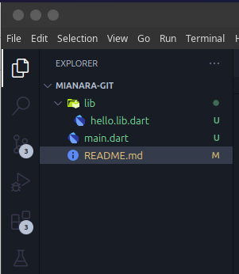
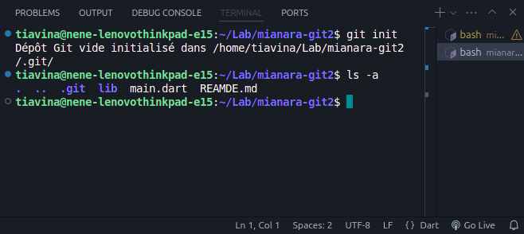
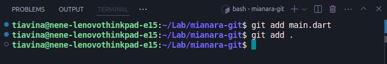
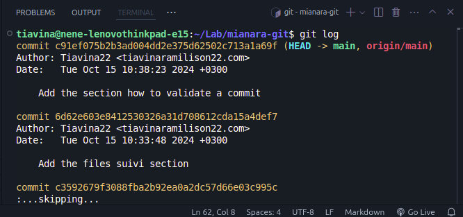

# GIT C'EST QUOI ?
Git est système de gestion de versionning, permmettant de suivre les modifications dans les fichiers de n'importe quelle projet. Il permet à plusieurs collaborateurs de collaborer efficacement sur le même projet, surtout projet IT.

## How to install Git ?
- Si vous êtes sur `windows` : Débrouillez-vous seul
- Si vous êtes sur `macOS` : Débrouillez-vous seul aussi
- Si vous êtes sur `Linux` : ok, suivez les instructions suivantes :
1 - Mettre à jour votre paquet d'abord
```shell
sudo apt update
```
2 - Installer git maintenant
```shell
sudo apt install git
```
De vita ny chocolat

## Il faut le configurer 
Aprè l'installation, il faut que vous configure votre informations d'utilisateur pour que git puisse les utiliser dans vos commits
```shell
git config --global user.name = "Votre Nom"
```
```shell
git config --global user.email = "Votre Email"
```

## Initialisation
Git fonctionne sur un dépôt ou repository en anglais dans lequel git suivra l'évolution de nos fichier.
Imaginons, on créer un simple projet avec dart avec le structure suivante :



Pour initialiser git dans notre projet, il faut qu'on positionne dans le répértoire root de notre projet, et puis :
```shell
git init
```
Cela crée un répertoire .git dans notre dossier, où git stockera les informations sur l'historique des versions :



## Suivi d'ajout des fichiers
Git ne suit pas automaquement tous les fichiers dans notre répertoire. On devrait ajouter manuellement les fichiers qu'on souhaite suivre :
```shell
git add nom_du_fichier
```
Pour ajouter tous les fichiers d'un coup
```shell
git add .
```



## Validation des commit (ou modifications)
Une fois les fichiers ajoutés, on devra `commiter` les changements pour les sauvegarder dans l'historique git :
```shell
git commit -m "Votre message de commit, ici essayer de spécifier ou de quoi vraiment votre modification"
```

## Visualisation des historiques du commit
Pour voir l'historique des changements sauvegarder dans le dépôt :
```shell
git log
```



## Travaille avec des branches